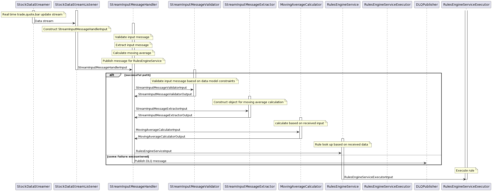

# Stock Trader App

Real time basic stock trader app built utilizing Alpaca stream APIs and this SDK: https://github.com/Petersoj/alpaca-java

## Introduction

This is a Maven project.

## Getting Started

To run this application, you need to create your own API keys and configure the logging settings.

### Prerequisites

- Java Development Kit (JDK) 8 or higher
- Maven (for building the project)

### Configuration

Sample Config file: 
```

alpaca.api.key=<alpaca-api-key>
alpaca.secret.key=<alpaca-secret-key>
alpaca.websocket.threadpool.size=1

#Threading Config
threadpool.corePoolSize=10
threadpool.maxPoolSize=20
threadpool.queueCapacity=50

#Stock config for user


#Stock symbols to subscribe to
subscription.stocks=AMZN,AAPL,GOOG,TSLA

#Stock of interest
target.stock=AAPL
```

#### 1. ALPACA API key configuration

1. Create a file named `application.properties` in the `src/main/resources` directory.
2. Add the following configuration with your Alpaca API credentials:
   ```properties
   alpaca.api.key=<your-alpaca-api-key>
   alpaca.secret.key=<your-alpaca-secret-key>
#### 2. Application Configuration
1. 
   ```properties
   alpaca.websocket.threadpool.size=<thread-pool-size>
   
#### 3. Logging Configuration
1. Create file logback.xml in src/main/resources
```

<configuration debug="true">
    <!-- Console Appender -->
    <appender name="STDOUT" class="ch.qos.logback.core.ConsoleAppender">
        <encoder>
            <pattern>%d{HH:mm:ss.SSS} [%thread] %-5level %logger{36} - %msg%n</pattern>
        </encoder>
    </appender>

    <!-- File Appender -->
    <appender name="FILE" class="ch.qos.logback.core.FileAppender">
        <!-- Ensure this path is correct and accessible -->
        <file>/path/to/log/file/myapp.log</file>
        <append>true</append>
        <encoder>
            <pattern>%d{yyyy-MM-dd HH:mm:ss.SSS} [%thread] %-5level %logger{36} - %msg%n</pattern>
        </encoder>
    </appender>

    <!-- Root Logger Configuration -->
    <root level="DEBUG">
        <appender-ref ref="STDOUT" />
        <appender-ref ref="FILE" />
    </root>

    <!-- Specific logger configuration -->
    <logger name="org.example.stocktrader" level="DEBUG"/>
</configuration>
```

### Running the Application

To build the project, run the following command in the project's root directory - 

```bash
mvn clean install

# Run the Application

mvn spring-boot:run

# To generate an executable JAR file, you can use the following command:
mvn package

#This command will create a JAR file in the `target` directory, which you can then run using:
java -jar target/<project-name>.jar

#If you need to clean the project and remove any generated files, you can use the following command:
mvn clean
```

### Error Handling 


1. Preventitive measures: Unit test, integration test, robust logging for early triage, extensive validations, specific retry configurations, load testing and canaries, robust rate limiting.
2. User Registration - DLQ -> Trigger lambda for ticketing -> on-call intervention. 
3. Stream handling:
- Application level and business use-case relevant retries.
- Custom retry policy for inter-service communication. 
- Proper metric/insights based alarm and warning signals.
- DLQ - Lambda - alarms and on call involvement (leverage internal LLM for timely action).

### Error Handling 
1. Upgrade dependencies to their recommended versions and implement spotbugs, checkstyle etc.
2. Refactor code for consistency in testing libraries and practices.
3. Robust error handling - one component might want to return a custom error message to the other.
4. Implementation of DLQ mechanisms. 
5. Implement multithreaded handling for input stream message handlers and complete implementation of unimplemented classes to make the structure more modular.

### Application Flow Sequence Diagram



